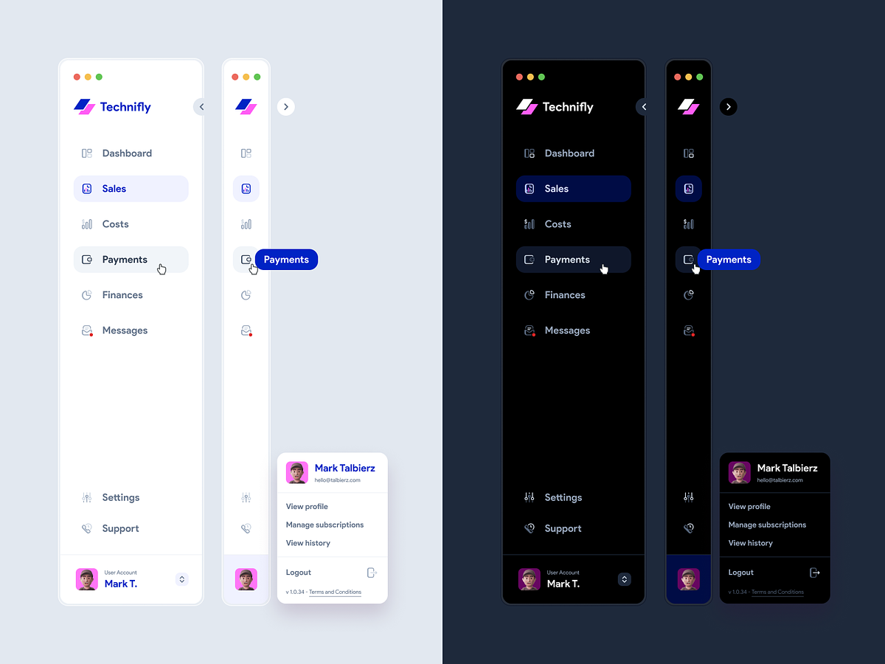

# Тестовое задание

Установка зависимостей `npm install`

Запуск проекта `npm run dev`

## Задание

Сверстать компонент `/src/components/Sidebar.jsx` по дизайну

[Анимированная версия](src/assets/design.mp4)

[Оригинал](https://dribbble.com/shots/18111119-Collapsing-Sidebar-Navigation-Light-and-Dark-mode)

#### Верстать нужно

- лого
- элементы навигации
- `hover`, `active` состояния у элементов сайдбара
- анимация при закрытии/открытии у элементов, которые скрываются/появляются

#### Верстать не нужно

- тултипы
- профиль
- анимация при загрузке страницы (не открытие/закрытие)

---

- иконки могут не соответствовать, это не так важно
- больше всего интересует анимация при открытии/закрытии
- достаточно одной темы (светлой или темной)
- pixel perfect не требуется, можно верстать на глаз
- логотип в проекте другой, используйте его
